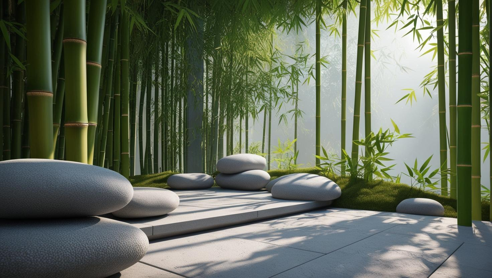

# Meditation-for-life-stress-free

Meditation for a Stress-Free Life
Welcome to the "Meditation for a Stress-Free Life" project. This website is designed to assist individuals in understanding and incorporating meditation into their daily lives to manage stress effectively.

About the Project: 
This project aims to introduce meditation as a viable solution to reduce stress and enhance well-being. It provides practical advice and insights into how meditation can transform your mental and physical health.

Features:
Introduction
Explore the core concepts of the website and what you can expect to learn about meditation and its life-changing benefits.

What is Meditation?
A detailed explanation of meditation, its historical context, and the various techniques that can be employed to achieve tranquility and focus.

Tips for a Stress-Free Life:
Practical tips and techniques to reduce stress through meditation. This section includes advice on setting up your meditation space, establishing routines, and more.

Stress Questionnaire:
An interactive section that helps users evaluate their current stress levels and provides customized advice based on their responses.

Technology:
Built with HTML and CSS, the website offers a responsive and user-friendly experience. Its design is simple and intuitive, ensuring users can easily navigate through the information.

Get Started
Navigate through the menu to explore different sections. Each one is designed to provide valuable insights and practical advice for adopting a meditative practice in your daily routine.

Thank you for visiting, and embark on your journey to a more peaceful and focused life :) This project was created to help people for free of charge :)

