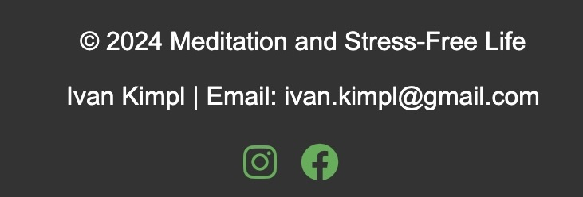
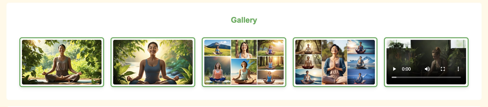
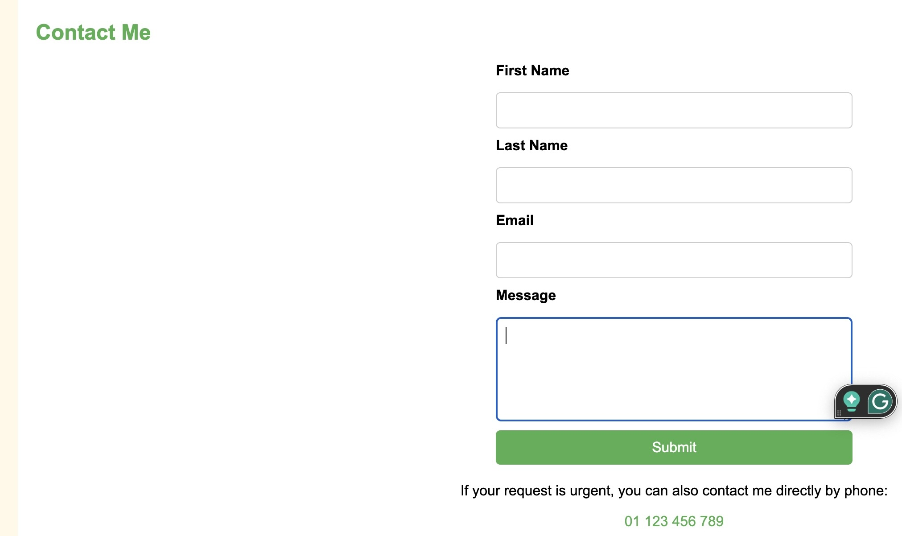
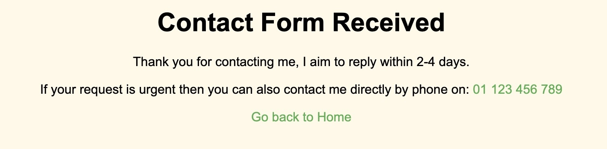
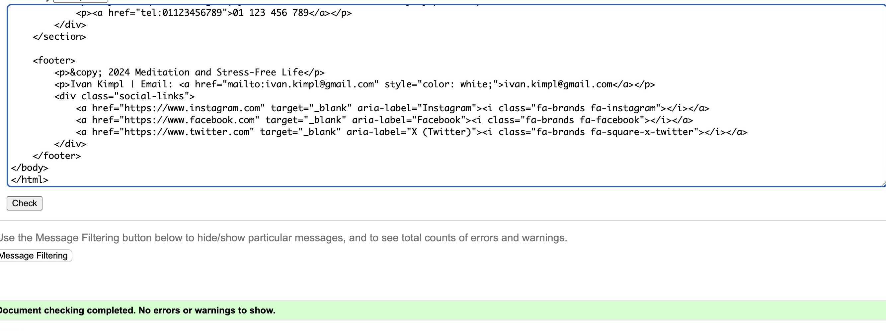
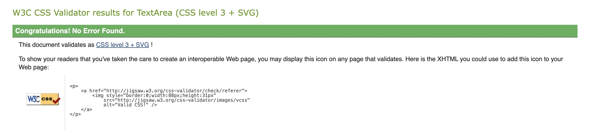

# Meditation-for-life-stress-free

## Introduction
Explore the core concepts of the website and what you can expect to learn about meditation and its life-changing benefits.

What is Meditation?
A detailed explanation of meditation, its historical context, and the various techniques that can be employed to achieve tranquility and focus.

Tips for a Stress-Free Life:
Practical tips and techniques to reduce stress through meditation. This section includes advice on setting up your meditation space, establishing routines, and more.

Stress Questionnaire:
An interactive section that helps users evaluate their current stress levels and provides customized advice based on their responses.

Technology:
Built with HTML and CSS, the website offers a responsive and user-friendly experience. Its design is simple and intuitive, ensuring users can easily navigate through the information.

Get Started
Navigate through the menu to explore different sections. Each one is designed to provide valuable insights and practical advice for adopting a meditative practice in your daily routine.

Thank you for visiting, and embark on your journey to a more peaceful and focused life :) This project was created to help people for free of charge :)

Meditation for a Stress-Free Life
Welcome to the "Meditation for a Stress-Free Life" project. This website is designed to assist individuals in understanding and incorporating meditation into their daily lives to manage stress effectively.

About the Project: 
This project aims to introduce meditation as a viable solution to reduce stress and enhance well-being. It provides practical advice and insights into how meditation can transform your mental and physical health.

## Navigation Menu

The website features a clean and intuitive navigation menu, located at the top of the page, designed to provide easy access to all major sections. The navigation menu includes the following links:

Home: Takes users back to the homepage.

Introduction: Offers an overview of the website and its purpose.

Meditation: Explains the concept of meditation and its benefits.

Tips for a Stress-Free Life: Provides practical advice and actionable tips for reducing stress.

Gallery: A visual showcase of peaceful imagery and a meditation video.

Contact: A form where users can reach out for more information or support.

Footer

The footer of the website provides essential contact information and social media links. It includes the copyright notice for the project, the author's name, and an email address for further communication. Additionally, it features social media icons for Instagram and Facebook, styled to match the overall theme of the website.

The navigation menu is styled with a vibrant green background (#4CAF50) to align with the theme of calmness and balance. It ensures a seamless browsing experience by remaining consistent across all devices, thanks to its responsive design.

Favicon

The favicon used in this project is a simple and meaningful emoji that aligns with the website's theme of meditation and tranquility. It is designed to provide a visually appealing and recognizable icon for the website in browser tabs. The favicon adds a personal and modern touch to the overall design.

## 404 Page
The 404.html page is a custom error page designed to inform users when they attempt to access a page that does not exist on the website. It features a simple message and a link to return to the homepage. This ensures a better user experience by gracefully handling broken links or incorrect URLs.

## Gallery Page
The Gallery Page showcases a selection of AI-generated images and a single video that represent the serene and calming essence of meditation. The content has been specifically designed to avoid any copyright concerns, ensuring originality.

Each image is styled with a consistent size and bordered with a subtle green frame to complement the website’s aesthetic. The included video adds a dynamic and engaging element, further enhancing the user experience. This section is visually appealing and helps users connect with the tranquility and mindfulness promoted by the website.

## Contact Form
Contact Form
The website includes a Contact Form designed to allow users to get in touch directly. It collects the following user details:

First Name
Last Name
Email Address
A personal message
Upon submission, the user is directed to a confirmation page with the message:
"Thank you for contacting me. I aim to reply within 2–4 days. If your request is urgent, you can also contact me directly by phone on: 01 123 456 789."
This ensures users receive clear acknowledgment of their message and know how to proceed in urgent cases.

The Contact Form is simple, accessible, and designed to improve user interaction and support.

### Thank You Page
After submitting the contact form, users will see this confirmation message.

## Existing Features

Responsive Design:
The website is fully responsive and optimized for different screen sizes, ensuring an excellent user experience on mobile, tablet, and desktop devices.

Navigation Menu:
A clean and intuitive navigation menu allows users to easily access various sections of the website, including the Introduction, Meditation, Tips, Gallery, and Contact pages.

Gallery Section:
The Gallery showcases visually appealing AI-generated images and one video that illustrate the meditative experience and a serene lifestyle.

Contact Form:
Users can submit their inquiries or messages directly through the Contact Form. A "Thank You" confirmation page acknowledges successful submissions and provides further contact details for urgent queries.

404 Error Page:
A custom 404 error page is displayed if users navigate to a nonexistent page, helping to maintain the site's professionalism.

Footer Section:
The footer includes copyright details, the author's contact information, and social media links to enhance user engagement and provide alternative communication channels.

Practical Meditation Tips:
A section dedicated to practical advice on incorporating meditation into daily routines, helping users lead a stress-free life.

### Features Left to Implement
Interactive Meditation Timer:
Add a built-in timer on the website to help users time their meditation sessions conveniently.

Audio and Guided Meditation Tracks:
Include downloadable or streamable meditation audio tracks that guide users through meditative practices.

User Accounts and Progress Tracking:
Allow users to create accounts, log their meditation progress, and receive personalized feedback or tips.

Multilingual Support:
Enable language options to make the website accessible to a broader audience globally.

Blog Section:
Add a blog page featuring articles about meditation techniques, mindfulness, and wellness tips to provide continuous value to users.

Dark Mode Option:
Provide a dark mode feature for users who prefer a less bright interface for nighttime browsing.

## Design

The design of the "Meditation for a Stress-Free Life" website was carefully planned to create a calming and user-friendly experience. The layout uses soft, natural colors such as green and beige to evoke a sense of tranquility and balance. The website employs a clean and minimalist aesthetic, ensuring that the content is the primary focus.

### Key Design Elements:
- **Color Scheme**: The green color used throughout the website symbolizes nature and harmony, while the beige background adds a soft, welcoming touch.
- **Typography**: Simple and readable fonts ensure that users can easily consume the information provided.
- **Responsive Design**: The website is fully responsive, providing an optimal viewing experience on various devices, including desktops, tablets, and smartphones.
- **Visual Elements**: The use of images and a video in the Gallery section enhances user engagement, while green borders around these visuals provide a cohesive design element.
- **Navigation**: The navigation menu is clean and easy to use, allowing users to quickly find the information they need.
- **Call to Action**: Clear buttons and links guide users to take action, such as exploring the Gallery or submitting a message via the Contact form.

The overall design aims to support the theme of stress reduction and mindfulness by delivering a serene, distraction-free interface.

## Technologies

The "Meditation for a Stress-Free Life" project was built using the following technologies:

- **HTML**: Used to structure the content of the webpage.
- **CSS**: Applied for styling and layout, ensuring a visually appealing and responsive design.
- **Git**: Utilized for version control and tracking code changes throughout the development process.
- **GitHub**: Used for hosting the project repository, allowing collaboration and code sharing.
- **Favicon**: A custom favicon was included to enhance the website's branding and provide a professional touch. The favicon appears in the browser tab and bookmark bar, helping users quickly identify the website. Various sizes of the favicon were implemented for compatibility across devices and browsers.

These technologies work together to deliver a functional, responsive, and user-friendly website that meets the project goals.

## Testing

The "Meditation for a Stress-Free Life" project underwent thorough testing to ensure it provides a seamless and user-friendly experience across all devices, including desktops, tablets, and mobile phones.

### Key Testing Points:
- **Responsive Design**: The website was tested on various screen sizes, ensuring all elements adjust gracefully and remain functional on desktops, tablets, and smartphones.
- **Navigation Menu**: All navigation links were tested to confirm they lead to the correct sections without errors.
- **Gallery Section**: Images and the video in the Gallery load properly, with consistent green borders around visual elements across devices.
- **Forms**: The Contact Form was validated to ensure all required fields work correctly, and users receive a confirmation message upon successful submission.
- **404 Page**: The custom 404 error page displays correctly when users try to access non-existent pages.
- **Cross-Browser Compatibility**: The website was tested on multiple browsers, including Chrome, Firefox, Safari, and Edge, to verify consistent performance.
- **Performance Testing**: The website was optimized for fast loading times, providing a smooth experience for users.

## Accessibility

The "Meditation for a Stress-Free Life" project was designed with accessibility in mind, ensuring that users of all abilities can interact with and benefit from the website. Key accessibility features include:

- **Semantic HTML**: Properly structured and meaningful HTML tags are used to improve screen reader compatibility and user navigation.
- **Color Contrast**: The color scheme was chosen to provide sufficient contrast, making text and visual elements easy to read.
- **Keyboard Navigation**: The website is fully navigable using a keyboard, ensuring that users who cannot use a mouse can still access all features.
- **Responsive Design**: The layout adapts seamlessly to different screen sizes, allowing users on desktops, tablets, and mobile devices to enjoy a consistent experience.
- **Alt Text**: All images and multimedia elements include descriptive `alt` attributes, aiding visually impaired users in understanding visual content.
- **Readable Fonts**: Fonts are simple and legible, enhancing readability for all users.
- **Clear Navigation**: A straightforward and intuitive navigation menu ensures users can find the information they need without difficulty.

By prioritizing these features, the website aligns with best practices for web accessibility, creating an inclusive experience for a diverse audience.

## Functional Testing

The "Meditation for a Stress-Free Life" project underwent thorough functional testing to ensure that all features work as intended and provide a smooth user experience. Key areas of functional testing include:

- **Navigation Menu**: Verified that all links in the navigation bar direct users to the correct sections of the webpage or external pages, ensuring an effortless browsing experience.
- **Gallery Section**: Ensured that all images and the video in the gallery load correctly, maintain proper formatting, and display within their respective green-bordered containers.
- **Contact Form**: Tested form functionality, including all input fields (first name, last name, email, and message). Verified form submission leads users to the thank-you page as expected.
- **404 Page**: Confirmed that attempting to access non-existent pages redirects users to the custom 404 page with an option to return to the homepage.
- **Responsiveness**: Tested on various devices (desktop, tablet, and mobile) to ensure the layout adjusts seamlessly and maintains usability across different screen sizes.
- **Buttons and Links**: Validated that all buttons and hyperlinks function correctly, providing expected results when clicked.

## Validation Results

The project was tested using W3C validation tools to ensure the HTML and CSS meet the web standards.

- **HTML Validation**:  
  

- **CSS Validation**:  
  

Both validations completed successfully without errors, confirming that the code is valid and adheres to standards.

## Deployment
The "Meditation for a Stress-Free Life" project was deployed using GitHub Pages to ensure easy access for users across various devices. Below are the steps followed for deployment:

- **Push the Code to GitHub Repository**: 

The entire project was developed locally and version-controlled using Git.
Changes were committed and pushed to the remote repository hosted on GitHub.
Enable GitHub Pages:

- **Navigate to the repository's settings on GitHub**: 
Under the "Pages" section, select the branch to deploy (e.g., main) and choose the / (root) folder.
Save the changes, and GitHub Pages will automatically build and deploy the site.
Access the Deployed Site:

The live website is now accessible through the URL provided by GitHub Pages.
Updates to the site are reflected automatically after pushing changes to the specified branch.

- **Key Benefits of Deployment via GitHub Pages**: 
Free Hosting: GitHub Pages provides a cost-effective way to host static websites.
Automatic Updates: Any changes pushed to the repository are automatically reflected on the live site.
User-Friendly URL: GitHub Pages generates an easy-to-share URL for the deployed project.

## Version Control
This project utilized Git for version control, ensuring that the development process was smooth, organized, and collaborative. Key aspects of version control implementation include:

- **Branching and Merging**:

Separate branches were created for feature development.
Changes were merged into the main branch after thorough testing and review.

- **Commit History**:

Clear and descriptive commit messages were used to track changes.
This ensured that the development progress could be reviewed and understood easily.

- **GitHub Integration**:

The project was hosted on GitHub, allowing for seamless collaboration and issue tracking.
GitHub's interface provided an efficient way to manage branches, pull requests, and resolve merge conflicts.
These practices ensured a reliable and traceable development process, resulting in a well-maintained project repository.

